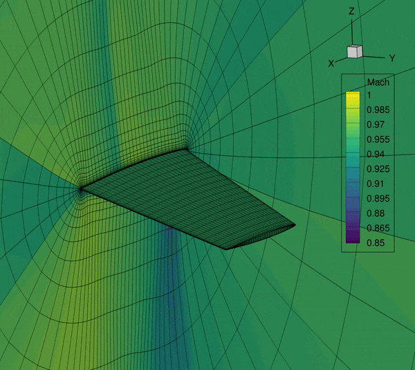
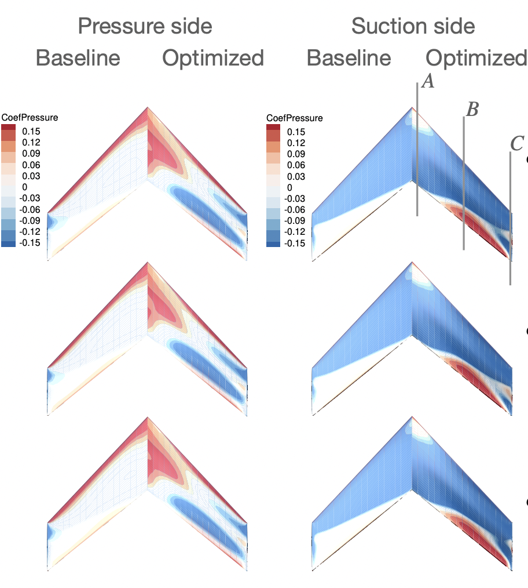
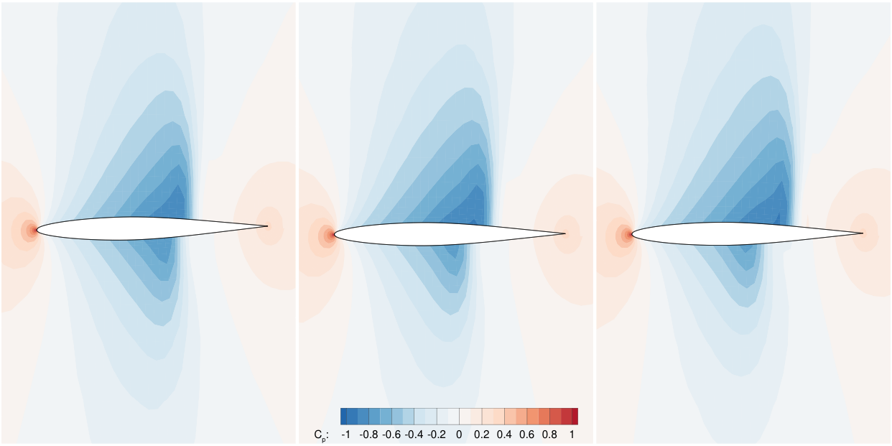
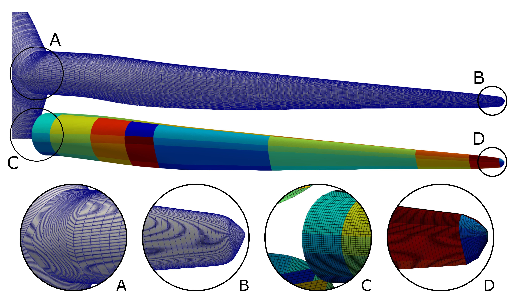
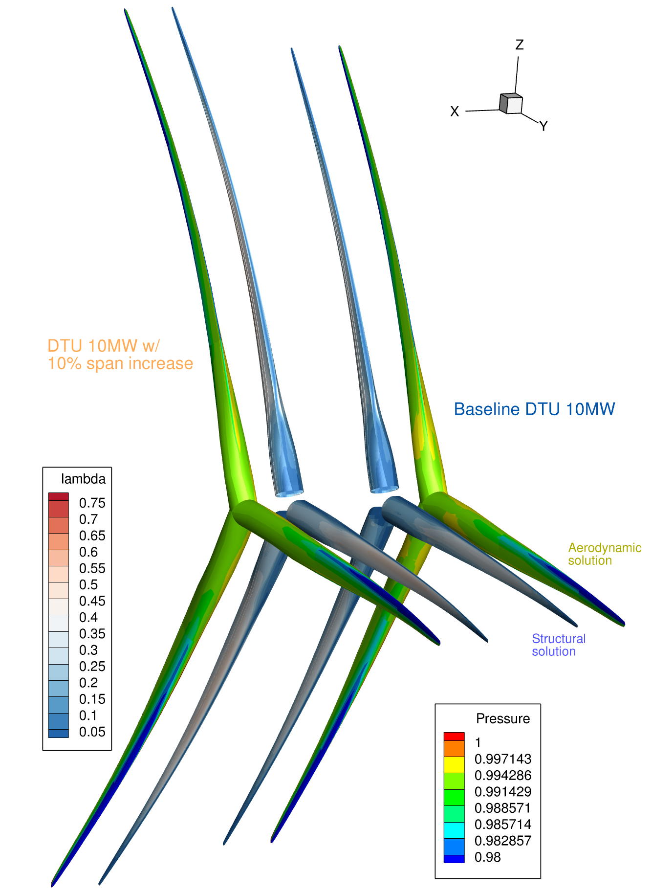
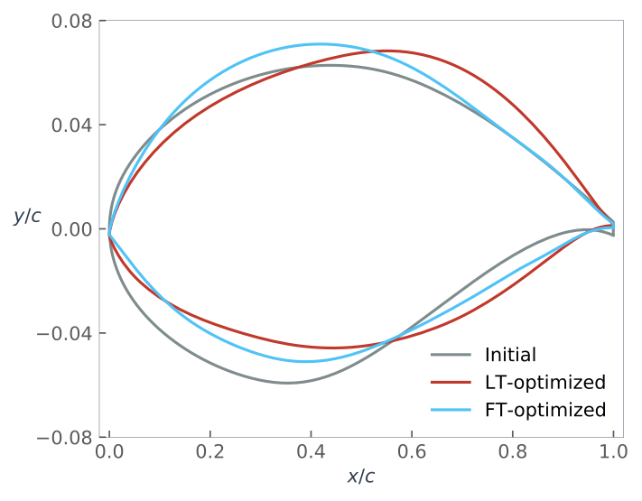
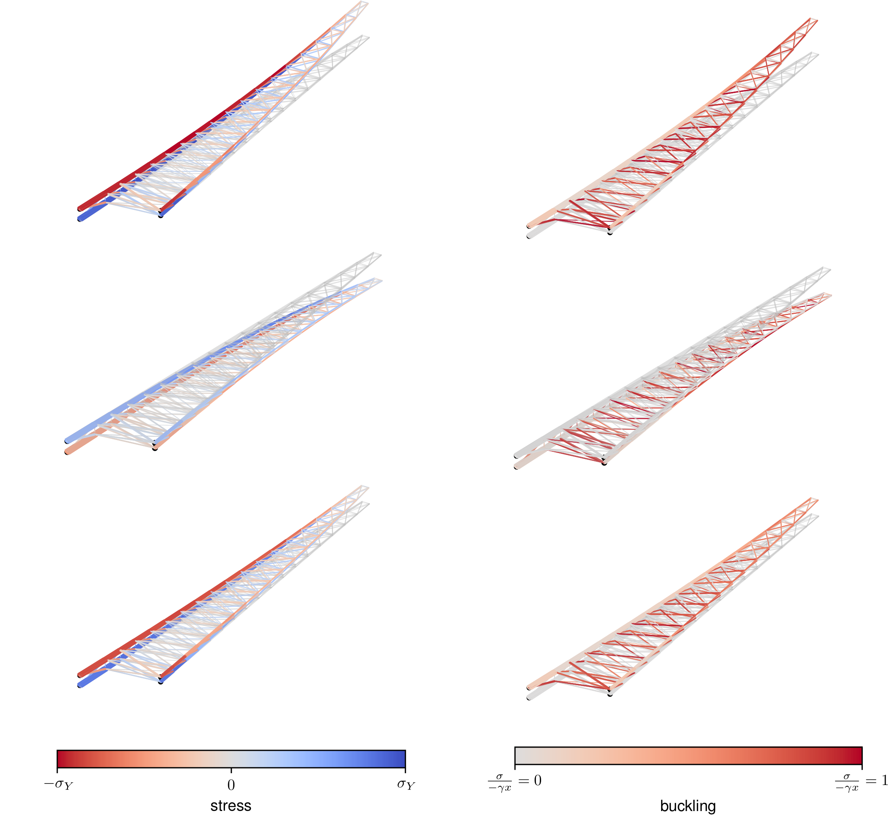
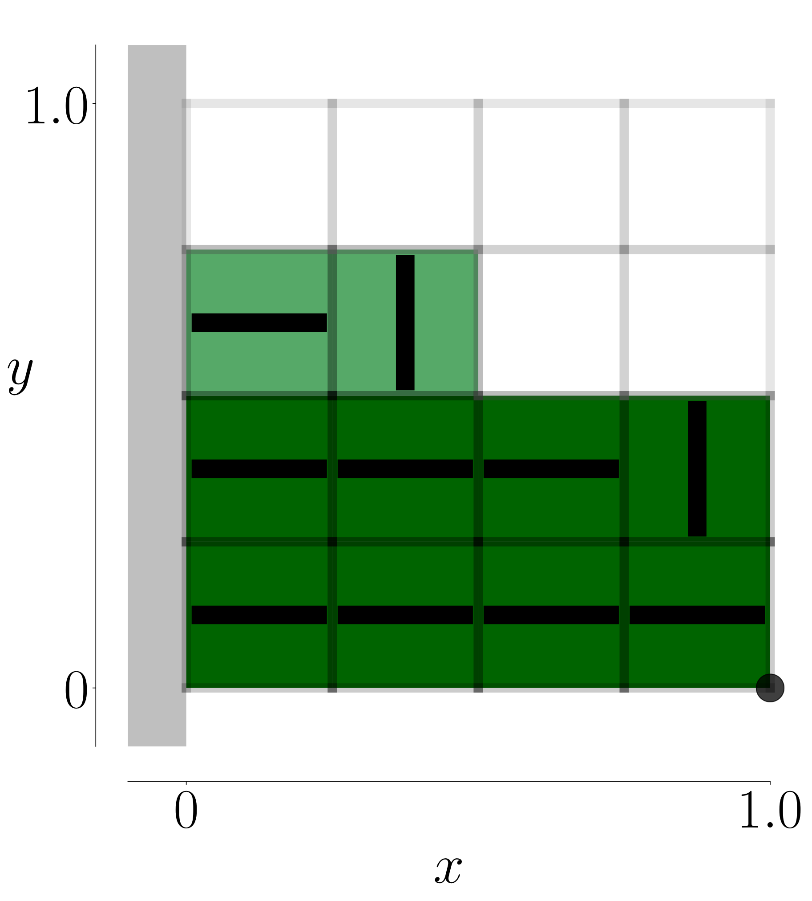
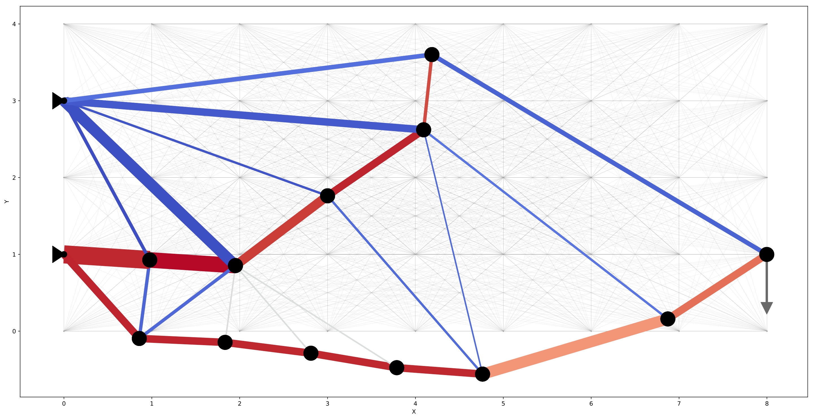
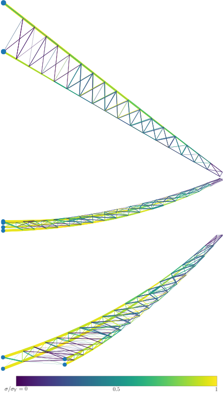

## 1. Aeroelastic optimization

The next-generation aircraft are trending with more flexible wings.
This makes the aircraft wings more susceptible to flutter.
However, the state-of-art MDO problem formulation usually only includes a steady-state aerostructure module and rarely a low-fidelity flutter module.
The missing or inaccurate flutter modeling in the aircraft conceptual design stage may cause costly redesign if the flutter is found in a later stage.
The fundamental question that I want to answer is that:
**How to design the future aircraft free from flutter?**
Answering this question, the aircraft designs generated from MDO will be much more realistic.

This project is closely related to the previous project because the aeroelastic problem is categorized as an LCO problem from the perspective of dynamical system theory.
To answer the question, we developed novel algorithms using time spectral method, Newton--Krylov method, and the coupled adjoint method to obtain good scalability with respect to both state and design variables.
The key finding of the research is that for LCO problem, it has a unique problem structure that shall be exploited by the solver to obtain the best computational performance.
Using our proposed methods, we obtain **the-first-of-it-kind** high-fidelity CFD-based aerodynamic shape optimization for a wing using the time-spectral method that improves the flutter speed by 118%.
This is my Ph.D. project.
I was awarded an AIAA Aviation Conference **best student paper award**.

|        |  |
|   :-:    | -       |
|  | __Sicheng He__, Eirikur Jonsson, Joaquim R. Martins.    [__Wing Aerodynamic Shape Optimization with Time Spectral Limit-Cycle Oscillation Adjoint__](https://arc.aiaa.org/doi/abs/10.2514/6.2022-3357).    _In AIAA Aviation, Chicago, IL, June 2022. American Institute of Aeronautics and Astronautics_.|
|  | __Sicheng He__, Eirikur Jonsson, Charles A. Mader, and Joaquim R. R. A. Martins.    [__Coupled Newton–Krylov timespectral solver for flutter and limit cycle oscillation prediction__](https://arc.aiaa.org/doi/10.2514/1.J059224)     _AIAA Journal_ (2021).|
|  | __Sicheng He__, Eirikur Jonsson, Charles A. Mader, and Joaquim R. R. A. Martins.    [__A coupled Newton–Krylov time-spectral solver for wing flutter and LCO prediction__](https://arc.aiaa.org/doi/10.2514/6.2019-3549).    _In AIAA Aviation Forum, Dallas, TX, June 2019_. (Best student paper award, 2nd place)|

## 2. Offshore Wind turbine aerostructural optimization

The state-of-the-art design optimization in the field assumes that the structure is rigid and the coupling between the structure and fluid is neglected.
In effect, such assumptions become problematic as the size of the wind turbine increases to improve efficiency and the structure is becoming more flexible.
In addition, by considering the coupling effect, we can explore a larger design space and design more efficient wind turbines.
In this research, the pressing question we plan to address is: **How can we optimize the wind turbine design with both structural and aerodynamic shape variables and account for their coupling?**

To answer that question, we apply the MDO algorithms together with computational fluid dynamics (CFD) and finite element analysis (FEA) tools.
The key finding of the research is that the aeroelastic coupling can be exploited to reduce the structure mass by about 2.2% compared with an optimized design without the coupling.
We obtained **the-first-of-it-kind** high-fidelity aerostructural optimization for wind turbines.
We are currently exploring using the composite to obtain passive load alleviation to further improve the performance of the wind turbine designs.

__Publication:__

|        |  |
|   :-:    | -       |
|  | Denis-Gabriel Caprace, Adam Cardoza, Teagan Nakamoto, Andrew Ning, Marco Mangano, __Sicheng He__, and Joaquim R. R. A. Martins.    [__Incorporating high-fidelity aerostructural analyses in wind turbine rotor optimization__](https://arc.aiaa.org/doi/abs/10.2514/6.2022-1290).    _In AIAA Scitech, San Diego, CA, January 2022. American Institute of Aeronautics and Astronautics_.|
|  | Marco Mangano, __Sicheng He__, Denis-Gabriel Caprace, Yingqian Liao, and Joaquim R. R. A. Martins.    [__Passive aeroelastic tailoring of large wind turbines using high-fidelity multidisciplinary design optimization__](https://arc.aiaa.org/doi/abs/10.2514/6.2022-1289).    _In AIAA Scitech, San Diego, CA, January 2022. American Institute of Aeronautics and Astronautics_.|

## 3. Aerodynamic shape optimization with laminar-turbulent transition model

We apply gradient-based optimization to design more efficient airfoils with the laminar-turbulent transition modeled by the $e^n$ method.
To compute derivatives with large number of design variables, we use the adjoint method.
One special challenge of the RANS with $e^n$ transition model is that we have the generalized eigenvalue problem embedded in the governing equation.
We propose two approaches to address this challenge:

1. Using the simplified $e^n$ model that approximate the eigenvalues (Shi2020).
2. Developing an adjoint equation and reverse algorithmic differentiation (RAD) formulas for the generalized eigenvalue problem with complex coefficient matrices (He2022, Shi2022).

The tools we developed in the second approach turns out to be very general and they can be applied to any eigenvalue and eigenvector derivatives of generalized eigenvalue problems with complex coefficient matrices.
Besides, we also generalize the method to derive RAD formulas based on [dot-product-identity](https://people.maths.ox.ac.uk/gilesm/files/NA-08-01.pdf) proposed by Prof. Giles from real functions to complex analytic functions.

__Publication:__

|        |  |
|   :-:    | -       |
|  | Yayun Shi, Charles A. Mader, __Sicheng He__, Gustavo L. O. Halila, and Joaquim R. R. A. Martins.    [__Natural laminarflow airfoil optimization design using a discrete adjoint approach__](https://arc.aiaa.org/doi/10.2514/1.J058944s)     _AIAA Journal_ (2020).|
|  | __Sicheng He__, Yayun Shi, Eirikur Jonsson, Joaquim R. R. A. Martins.     [__Eigenvalue problem derivatives computation for a complex matrix using the adjoint method__](https://www.researchgate.net/publication/362931690_Eigenvalue_problem_derivatives_computation_for_a_complex_matrix_using_the_adjoint_method)     _MSSP (accepted)_ (2023).|

## 4. Structural global optimization using mixed integer linear or second order cone optimization (MILO and MISOCO)

The state-of-the-art of topology design optimization using solid isotropic material with penalization  (SIMP) solves the mixed integer nonlinear programming problem without any guarantee of global optimality.
In this research, we try to address the following question: **How can we solve the topology and sizing optimization problem to their global optimality?**

To answer that question, we reformulate the problems as mixed integer linear or second order cone optimization formulations following earlier works by [Prof. Mathias Stolpe](https://orbit.dtu.dk/en/persons/jesper-mathias-stolpe).
We are able to solve truss wing optimization problems with hundreds of binary variables and composite plate with dozens of binary variables.
One best configuration out of **1.85 trillion** possible configurations is found for the composite plate optimization problem.

__Publication:__

|        |  |
|   :-:    | -       |
|  | Ramin Fakhimi, Mohammad Shahabsafa, Weiming Lei, __Sicheng He__, Joaquim R. R. A. Martins, Luis Zuluaga, and Tamas Terlaky.     [__Discrete multi-load truss sizing optimization: model analysis and computational experimentss__](https://link.springer.com/article/10.1007/s11081-021-09672-6)     _Optimization and Engineering_ (2021).|
|  | __Sicheng He__, Mohammad Shahabsafa, Weiming Lei, Ali Mohammad-Nezhad, Tamas Terlaky, Luis Zuluaga, and Joaquim R. R. A. Martins.    [__Mixed-integer second-order cone optimization for composite discrete ply-angle and thickness topology optimization problems__](https://link.springer.com/article/10.1007/s11081-020-09573-0)     _Optimization and Engineering_ (2020).|
|  | Mohammad Shahabsafa, Ramin Fakhimi, Weiming Lei, __Sicheng He__, Luis Zuluaga, Joaquim R. R. A. Martins, and Tamas Terlaky.    [__Truss topology design and sizing optimization with guaranteed kinematic stability__](https://link.springer.com/article/10.1007/s00158-020-02698-x)     _Structural and Multidisciplinary Optimization_ (2020).|
|  | Mohammad Shahabsafa, Ali Mohammad-Nezhad, Tamas Terlaky, Luis Zuluaga, __Sicheng He__, John T. Hwang, and Joaquim R. R. A. Martins.    [__A novel approach to discrete truss design problems using mixed integer neighborhood search__](https://link.springer.com/article/10.1007/s00158-018-2099-8)     _Structural and Multidisciplinary Optimization_ (2018).|
