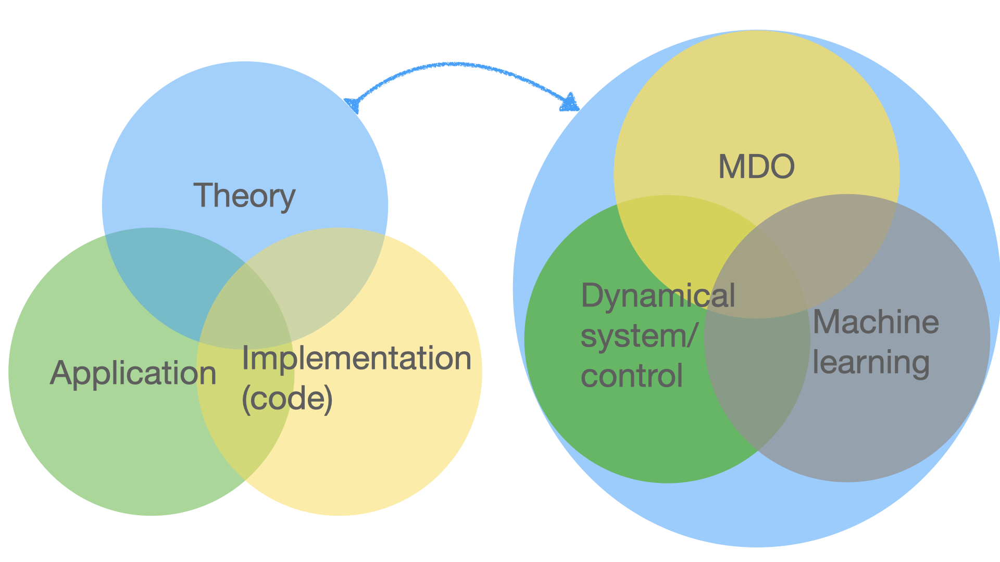

Table of content
<!-- - [Research vision](#research-vision) -->
- [Research projects](#research-projects)
  - [1. Modal analysis](#1-modal-analysis)
  - [2. Time spectral method](#2-time-spectral-method)
  - [3. MDO + dynamical systems and control](#3-mdo--dynamical-systems-and-control)
  - [4. Machine learning in aerodynamic shape optimization](#4-machine-learning-in-aerodynamic-shape-optimization)
  - [5. Differentiable data assimilation](#5-differentiable-data-assimilation)
- [Past research projects](#past-research-projects)
  - [1. Aeroelastic optimization](#1-aeroelastic-optimization)
  - [2. Offshore Wind turbine aerostructural optimization](#2-offshore-wind-turbine-aerostructural-optimization)
  - [3. Aerodynamic shape optimization with laminar-turbulent transition model](#3-aerodynamic-shape-optimization-with-laminar-turbulent-transition-model)
  - [4. Structural global optimization using mixed integer linear or second order cone optimization (MILO and MISOCO)](#4-structural-global-optimization-using-mixed-integer-linear-or-second-order-cone-optimization-milo-and-misoco)

<!-- # Research vision
I design efficient and environmentally friendly aircraft by developing efficient algorithms and code implementation. 
I conduct interdisciplinary research--the three domains I have been researching are multidisciplinary design optimization (MDO), dynamical system and control, and machine learning. 
In my research, I develop new theories to convert previously untackled dynamical systems and control optimization problems into a computationally efficient formulation. 
Leveraging the new theory, I develop programs to solve problems on a large scale using high-fidelity physical models. 
Using high-fidelity physical model data, I train machine learning models to expedite simulation and design optimization.
The unique combination of high-fidelity models and dynamical systems and control of my research can potentially make an impact in fields including aerospace, wind energy, robotics, and automobile industries.

The research vision that differentiates me from other labs working on MDO is listed below:
1. **(Theory)** MDO shall be enabled to address ever **more complex dynamical systems and control problems** beyond the current focus, i.e., the steady-state problems.
2. **(Implementation/code)** **Efficient and general-purpose codes** for design optimization in dynamical systems and control shall be developed leveraging the abstraction ability of the mathematical representation.
3. **(Application)** I develop **environmentally friendly engineering designs**, such as efficient off-shore wind turbines, and aircraft with less noise and emission, to address critical climate and energy challenges of modern society. -->

# Research projects

## 1. Modal analysis

*Velocity resolvent response mode on the NASA Common Research Model wing, computed using our matrix-free resolvent analysis framework.*

Modal analysis decomposes dynamical systems into modes that reveal stability, frequency response, and dominant structures.
**How can we perform modal analysis on large-scale engineering systems efficiently?**

Our research has two thrusts:

**Differentiable modal analysis:**
We develop adjoint-based differentiable modal analysis tools that enable gradient-based optimization.
We developed the first **fully matrix-free resolvent analysis** for 3D aerodynamic systems, demonstrated on the NASA CRM with **1.8 million cells**.
We also developed **differentiable resolvent analysis** for flow control optimization and **differentiable POD** for modal-centric field inversion.

**Time-spectral modal analysis:**
We extend modal analysis to time-periodic base flows using time-spectral discretization.
We developed **spectral Floquet analysis** that computes stability of periodic orbits with spectral accuracy, and **time-spectral resolvent analysis** that extends frequency response analysis to periodically forced systems.

__Publication:__

|        |  |
|   :-:    | -       |
|  | __Sicheng He__, Rohit Kanchi.     __Matrix-Free Resolvent Analysis for Large-Scale Aerodynamic Systems__     _in preparation_.|
|  | __Sicheng He__, Shugo Kaneko, Daning Huang, Chi-An Yeh, Joaquim R. R. A. Martins.     __Large-Scale Flow Control Performance Optimization via Differentiable Resolvent Analysis__     _in preparation_.|
|  | __Sicheng He__, Max Howell, Dan Wilson.     __Spectral Floquet Analysis__     _in preparation_.|
|  | Max Howell, __Sicheng He__.     [__Time-Spectral Resolvent Analysis for Periodic Dynamical Systems__](https://arxiv.org/abs/2602.15194)     _arXiv preprint_ (2026).|
|  | Rohit Sunil Kanchi, __Sicheng He__.     [__Modal-Centric Field Inversion via Differentiable Proper Orthogonal Decomposition__](https://arxiv.org/abs/2601.14858)     _arXiv preprint_ (2026).|
|  | __Sicheng He__, Eirikur Jonsson, Jichao Li, Joaquim R. R. A. Martins.     [__Adjoint-Based Design Optimization of Stability Constrained Systems__](https://arc.aiaa.org/doi/10.2514/1.J064273)     _AIAA Journal_ (2024).|
|  | __Sicheng He__, Max Howell, Daning Huang, Eirikur Jonsson, Galen W. Ng, Joaquim R. R. A. Martins.     [__Adjoint-based Hopf-bifurcation Instability Suppression via First Lyapunov Coefficient__](https://arxiv.org/abs/2511.03840)     _arXiv preprint_ (2025).|

## 2. Time spectral method

*A quasi-periodic trajectory on a torus—the torus time-spectral method solves for the solution directly on this manifold.*

The time spectral method transforms time-dependent problems into frequency-domain systems, avoiding expensive time marching.
**How can we extend the time spectral method to quasi-periodic dynamics with multiple incommensurate frequencies?**

We developed the **torus time-spectral method (TTSM)** that lifts governing equations to an extended angular phase space and applies double-Fourier collocation on the invariant torus, achieving **spectral convergence**.
Building on the time-spectral framework, we also developed **spectral Floquet analysis** and **time-spectral resolvent analysis** for stability and frequency response of periodic systems (see also [Modal analysis](#1-modal-analysis)).

__Publication:__

|        |  |
|   :-:    | -       |
|  | __Sicheng He__, Hang Li, Kivanc Ekici.     [__Torus Time-Spectral Method for Quasi-Periodic Problems__](https://arxiv.org/abs/2512.13631)     _arXiv preprint_ (2025).|
|  | __Sicheng He__.     __Torus Time-Spectral Method for Three-Dimensional Wing Oscillations with Two Incommensurate Frequencies__     _in preparation_.|
|  | __Sicheng He__, Max Howell, Dan Wilson.     __Spectral Floquet Analysis__     _in preparation_.|
|  | Max Howell, __Sicheng He__.     [__Time-Spectral Resolvent Analysis for Periodic Dynamical Systems__](https://arxiv.org/abs/2602.15194)     _arXiv preprint_ (2026).|

## 3. MDO + dynamical systems and control

The MDO community has focused on steady-state systems, leaving bifurcation, LCO, and chaotic systems largely unaddressed.
**How can we optimize general high-fidelity multidisciplinary dynamical systems with or without control?**

We develop adjoint methods that exploit the unique structure of each dynamical system class for computational efficiency.
Key results include: adjoint-based **control co-design** that reduces drone control cost by **~30%** at a cost independent of design variable count, and a **fundamental** reverse algorithmic differentiation method for complex analytic functions that yields the **first succinct eigenvalue derivative formula for general complex matrices**.

__Publication:__

|        |  |
|   :-:    | -       |  
|  | __Sicheng He__, Shugo Kaneko, Eirikur Jonsson, Marco Mangano, Joaquim R. R. A. Martins.     [__Control co-design sensitivity computation using the adjoint method__](https://www.researchgate.net/publication/362931690_Eigenvalue_problem_derivatives_computation_for_a_complex_matrix_using_the_adjoint_method)     _submitted to SIAM applied dynamics (SIADS)_ (2022).|
|  | __Sicheng He__, Eirikur Jonsson, Joaquim R. R. A. Martins.     [__Adjoint-based Limit Cycle Oscillation Instability Sensitivity and Suppression__](https://www.researchgate.net/publication/363581644_Adjoint-based_Limit_Cycle_Oscillation_Instability_Sensitivity_and_Suppression)     _Nonlinear dynamics_ (2022).|
|  | __Sicheng He__, Yayun Shi, Eirikur Jonsson, Joaquim R. R. A. Martins.     [__Eigenvalue problem derivatives computation for a complex matrix using the adjoint method__](https://www.researchgate.net/publication/362931690_Eigenvalue_problem_derivatives_computation_for_a_complex_matrix_using_the_adjoint_method)     _MSSP (accepted)_ (2023).|
|  | __Sicheng He__, Eirikur Jonsson, and joaquim R. R. A. Martins.     [__Derivatives for Eigenvalues and Eigenvectors via Analytic Reverse Algorithmic Differentiation__](https://arc.aiaa.org/doi/abs/10.2514/1.J060726?journalCode=aiaaj)     _AIAA Journal_ (2022).|

## 4. Machine learning in aerodynamic shape optimization

**How can we accelerate aerodynamic shape optimization using machine learning?**

We develop gradient-enhanced neural network surrogate models for aerodynamic design.
We are the first to apply Sobolev training (gradient-enhanced neural networks) to obtain **state-of-the-art** airfoil aerodynamic surrogates, enabling **real-time** analysis and optimization.
This powers the online airfoil simulation website [Webfoil](http://webfoil.engin.umich.edu/).

|        |  |
|   :-:    | -       |  
|  | Jichao Li, __Sicheng He__, Mengqi Zhang, Joaquim R. R. A. Martins, Boo Cheong Khoo.     [__Physics-Based Data-Driven Buffet-Onset Constraint for Aerodynamic Shape Optimization__](https://arc.aiaa.org/doi/10.2514/1.J061519)     _AIAA Journal_ (2022).|
|  | Mohamed Amine Bouhlel, __Sicheng He__, and Joaquim R. R. A. Martins.    [__Scalable gradient-enhanced artificial neural networks for airfoil shape design in the subsonic and transonic regimes__](https://link.springer.com/article/10.1007/s00158-020-02488-5)     _Structural and Multidisciplinary Optimization_ (2020). (Webfoil)|
|  | Jichao Li, __Sicheng He__, and Joaquim R. R. A. Martins.    [__Data-driven constraint approach to ensure low-speed performance in transonic aerodynamic shape optimization__](https://www.sciencedirect.com/science/article/pii/S1270963819304912)     _Aerospace Science and Technology_ (2019).|

## 5. Differentiable data assimilation

Data assimilation combines computational models with observational data to produce accurate state estimates.
Classical methods like the Kalman filter assume accurate system dynamics, but in practice the models are approximate.
The question we address is:
**How can we systematically reduce the mismatch between approximate and true system dynamics in state estimation?**

We developed the **differentiable Kalman filter (DKF)**, an adjoint-based optimization framework that uses field inversion followed by neural network closure model training to correct model errors.
The DKF achieves at least **90% reduction in state reconstruction error** compared to classical Kalman filters across various noise levels while maintaining robust uncertainty quantification.

__Publication:__

|        |  |
|   :-:    | -       |
|  | Yuan Wu, __Sicheng He__.     [__DKFNet: Differentiable Kalman Filter for Field Inversion and Machine Learning__](https://arxiv.org/abs/2509.07474)     _arXiv preprint_ (2025).|

# Past research projects

## 1. Aeroelastic optimization

The next-generation aircraft are trending with more flexible wings.
This makes the aircraft wings more susceptible to flutter.
However, the state-of-art MDO problem formulation usually only includes a steady-state aerostructure module and rarely a low-fidelity flutter module.
The missing or inaccurate flutter modeling in the aircraft conceptual design stage may cause costly redesign if the flutter is found in a later stage.
The fundamental question that I want to answer is that:
**How to design the future aircraft free from flutter?**
Answering this question, the aircraft designs generated from MDO will be much more realistic.

This project is closely related to the previous project because the aeroelastic problem is categorized as an LCO problem from the perspective of dynamical system theory.
To answer the question, we developed novel algorithms using time spectral method, Newton--Krylov method, and the coupled adjoint method to obtain good scalability with respect to both state and design variables.
The key finding of the research is that for LCO problem, it has a unique problem structure that shall be exploited by the solver to obtain the best computational performance.
Using our proposed methods, we obtain **the-first-of-it-kind** high-fidelity CFD-based aerodynamic shape optimization for a wing using the time-spectral method that improves the flutter speed by 118%.
This is my Ph.D. project. 
I was awarded an AIAA Aviation Conference **best student paper award**.

|        |  |
|   :-:    | -       |  
|  | __Sicheng He__, Eirikur Jonsson, Joaquim R. Martins.    [__Wing Aerodynamic Shape Optimization with Time Spectral Limit-Cycle Oscillation Adjoint__](https://arc.aiaa.org/doi/abs/10.2514/6.2022-3357).    _In AIAA Aviation, Chicago, IL, June 2022. American Institute of Aeronautics and Astronautics_.|
|  | __Sicheng He__, Eirikur Jonsson, Charles A. Mader, and Joaquim R. R. A. Martins.    [__Coupled Newton–Krylov timespectral solver for flutter and limit cycle oscillation prediction__](https://arc.aiaa.org/doi/10.2514/1.J059224)     _AIAA Journal_ (2021).|
|  | __Sicheng He__, Eirikur Jonsson, Charles A. Mader, and Joaquim R. R. A. Martins.    [__A coupled Newton–Krylov time-spectral solver for wing flutter and LCO prediction__](https://arc.aiaa.org/doi/10.2514/6.2019-3549).    _In AIAA Aviation Forum, Dallas, TX, June 2019_. (Best student paper award, 2nd place)|

## 2. Offshore Wind turbine aerostructural optimization

The state-of-the-art design optimization in the field assumes that the structure is rigid and the coupling between the structure and fluid is neglected.
In effect, such assumptions become problematic as the size of the wind turbine increases to improve efficiency and the structure is becoming more flexible.
In addition, by considering the coupling effect, we can explore a larger design space and design more efficient wind turbines.
In this research, the pressing question we plan to address is: **How can we optimize the wind turbine design with both structural and aerodynamic shape variables and account for their coupling?**

To answer that question, we apply the MDO algorithms together with computational fluid dynamics (CFD) and finite element analysis (FEA) tools. 
The key finding of the research is that the aeroelastic coupling can be exploited to reduce the structure mass by about 2.2% compared with an optimized design without the coupling.
We obtained **the-first-of-it-kind** high-fidelity aerostructural optimization for wind turbines.
We are currently exploring using the composite to obtain passive load alleviation to further improve the performance of the wind turbine designs.

__Publication:__

|        |  |
|   :-:    | -       |  
|  | Denis-Gabriel Caprace, Adam Cardoza, Teagan Nakamoto, Andrew Ning, Marco Mangano, __Sicheng He__, and Joaquim R. R. A. Martins.    [__Incorporating high-fidelity aerostructural analyses in wind turbine rotor optimization__](https://arc.aiaa.org/doi/abs/10.2514/6.2022-1290).    _In AIAA Scitech, San Diego, CA, January 2022. American Institute of Aeronautics and Astronautics_.|
|  | Marco Mangano, __Sicheng He__, Denis-Gabriel Caprace, Yingqian Liao, and Joaquim R. R. A. Martins.    [__Passive aeroelastic tailoring of large wind turbines using high-fidelity multidisciplinary design optimization__](https://arc.aiaa.org/doi/abs/10.2514/6.2022-1289).    _In AIAA Scitech, San Diego, CA, January 2022. American Institute of Aeronautics and Astronautics_.|

## 3. Aerodynamic shape optimization with laminar-turbulent transition model

We apply gradient-based optimization to design more efficient airfoils with the laminar-turbulent transition modeled by the $e^n$ method. 
To compute derivatives with large number of design variables, we use the adjoint method.
One special challenge of the RANS with $e^n$ transition model is that we have the generalized eigenvalue problem embedded in the governing equation. 
We propose two approaches to address this challenge:

1. Using the simplified $e^n$ model that approximate the eigenvalues (Shi2020).
2. Developing an adjoint equation and reverse algorithmic differentiation (RAD) formulas for the generalized eigenvalue problem with complex coefficient matrices (He2022, Shi2022).
  
The tools we developed in the second approach turns out to be very general and they can be applied to any eigenvalue and eigenvector derivatives of generalized eigenvalue problems with complex coefficient matrices.
Besides, we also generalize the method to derive RAD formulas based on [dot-product-identity](https://people.maths.ox.ac.uk/gilesm/files/NA-08-01.pdf) proposed by Prof. Giles from real functions to complex analytic functions.

__Publication:__

|        |  |
|   :-:    | -       |  
|  | Yayun Shi, Charles A. Mader, __Sicheng He__, Gustavo L. O. Halila, and Joaquim R. R. A. Martins.    [__Natural laminarflow airfoil optimization design using a discrete adjoint approach__](https://arc.aiaa.org/doi/10.2514/1.J058944s)     _AIAA Journal_ (2020).|
|  | __Sicheng He__, Yayun Shi, Eirikur Jonsson, Joaquim R. R. A. Martins.     [__Eigenvalue problem derivatives computation for a complex matrix using the adjoint method__](https://www.researchgate.net/publication/362931690_Eigenvalue_problem_derivatives_computation_for_a_complex_matrix_using_the_adjoint_method)     _MSSP (accepted)_ (2023).|

## 4. Structural global optimization using mixed integer linear or second order cone optimization (MILO and MISOCO)

The state-of-the-art of topology design optimization using solid isotropic material with penalization  (SIMP) solves the mixed integer nonlinear programming problem without any guarantee of global optimality.
In this research, we try to address the following question: **How can we solve the topology and sizing optimization problem to their global optimality?**

To answer that question, we reformulate the problems as mixed integer linear or second order cone optimization formulations following earlier works by [Prof. Mathias Stolpe](https://orbit.dtu.dk/en/persons/jesper-mathias-stolpe).
We are able to solve truss wing optimization problems with hundreds of binary variables and composite plate with dozens of binary variables.
One best configuration out of **1.85 trillion** possible configurations is found for the composite plate optimization problem.

__Publication:__

|        |  |
|   :-:    | -       |  
|  | Ramin Fakhimi, Mohammad Shahabsafa, Weiming Lei, __Sicheng He__, Joaquim R. R. A. Martins, Luis Zuluaga, and Tamas Terlaky.     [__Discrete multi-load truss sizing optimization: model analysis and computational experimentss__](https://link.springer.com/article/10.1007/s11081-021-09672-6)     _Optimization and Engineering_ (2021).|
|  | __Sicheng He__, Mohammad Shahabsafa, Weiming Lei, Ali Mohammad-Nezhad, Tamas Terlaky, Luis Zuluaga, and Joaquim R. R. A. Martins.    [__Mixed-integer second-order cone optimization for composite discrete ply-angle and thickness topology optimization problems__](https://link.springer.com/article/10.1007/s11081-020-09573-0)     _Optimization and Engineering_ (2020).|
|  | Mohammad Shahabsafa, Ramin Fakhimi, Weiming Lei, __Sicheng He__, Luis Zuluaga, Joaquim R. R. A. Martins, and Tamas Terlaky.    [__Truss topology design and sizing optimization with guaranteed kinematic stability__](https://link.springer.com/article/10.1007/s00158-020-02698-x)     _Structural and Multidisciplinary Optimization_ (2020).|
|  | Mohammad Shahabsafa, Ali Mohammad-Nezhad, Tamas Terlaky, Luis Zuluaga, __Sicheng He__, John T. Hwang, and Joaquim R. R. A. Martins.    [__A novel approach to discrete truss design problems using mixed integer neighborhood search__](https://link.springer.com/article/10.1007/s00158-018-2099-8)     _Structural and Multidisciplinary Optimization_ (2018).|