

<strong style="font-style: normal;">Our mission:</strong> To develop structured and differentiable representations of complex dynamical systems that enable scalable analysis, physical insight, and optimal design.

Our research is organized around three pillars: (1) **structured representations** of nonlinear dynamics, (2) **operator-theoretic analysis** and interpretable reduced coordinates, and (3) **optimization, control, and learning** of dynamical systems.

# Research

## 1. Structured representations of nonlinear dynamics

*A quasi-periodic trajectory on a torus—the torus time-spectral method solves for the solution directly on this manifold.*

**How do we build compact, structured representations of nonlinear time-dependent dynamics?**

We develop spectral and frequency-domain frameworks that replace brute-force time marching with structure-exploiting representations of periodic and quasi-periodic behavior.
Our work follows a natural progression: **represent** the motion via time-spectral methods, **generalize** to multi-frequency motion via torus methods, and **characterize stability** of the represented motion via Floquet theory.

Key contributions include the **torus time-spectral method (TTSM)** that lifts governing equations to an extended angular phase space with **spectral convergence**, **spectral Floquet analysis** for orbital stability of periodic systems, and **time-spectral resolvent analysis** for frequency response of periodically varying base flows.

__Publication:__

|        |  |
|   :-:    | -       |
| 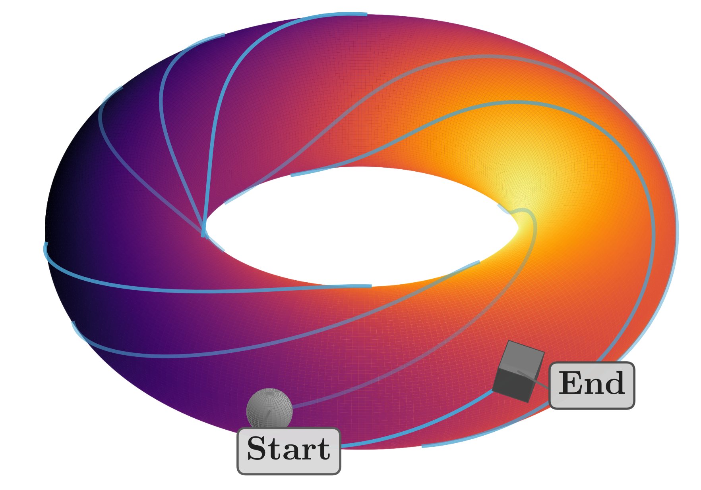 | __Sicheng He__, Hang Li, Kivanc Ekici.     [__Torus Time-Spectral Method for Quasi-Periodic Problems__](https://arxiv.org/abs/2512.13631)     _arXiv preprint_ (2025).|
| 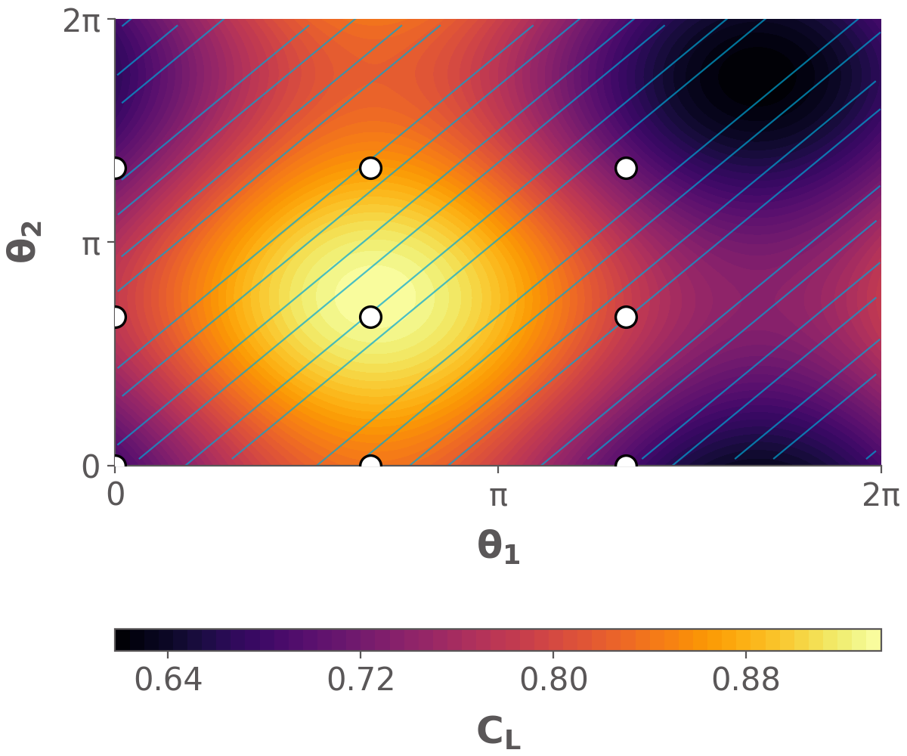 | __Sicheng He__, Rohit Kanchi.     __Torus Time-Spectral Method for Three-Dimensional Wing Oscillations with Two Incommensurate Frequencies__     _in preparation_.|
| 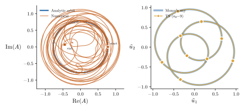 | __Sicheng He__, Max Howell, Dan Wilson.     __Spectral Floquet Analysis__     _in preparation_.|
| 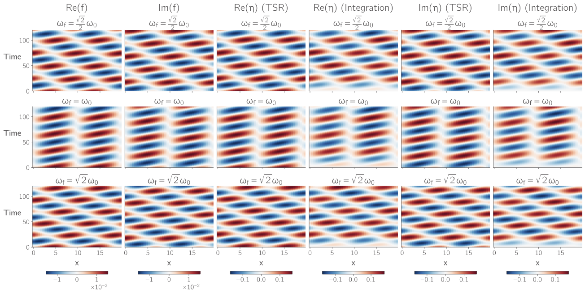 | Max Howell, __Sicheng He__.     [__Time-Spectral Resolvent Analysis for Periodic Dynamical Systems__](https://arxiv.org/abs/2602.15194)     _arXiv preprint_ (2026).|

## 2. Operator-theoretic analysis and interpretable reduced coordinates

*Velocity resolvent response mode on the NASA Common Research Model wing, computed using our matrix-free resolvent analysis framework.*

**How do we extract the dominant mechanisms, coordinates, and sensitivities from large-scale nonlinear systems?**

We build modal and operator-based tools to turn simulation data or linearized operators into understanding: what modes matter, what forcing/response structures dominate, and how sensitivities propagate through modal objects.
Critically, our analysis tools are not passive diagnostics—they are made **optimization-ready** through differentiable formulations that connect directly to gradient-based design.

Key contributions include the first **fully matrix-free resolvent analysis** for 3D aerodynamic systems (NASA CRM, **1.8 million cells**), **differentiable resolvent analysis** for flow control optimization, and **differentiable POD** for optimization-compatible modal decompositions and field inversion.

__Publication:__

|        |  |
|   :-:    | -       |
| 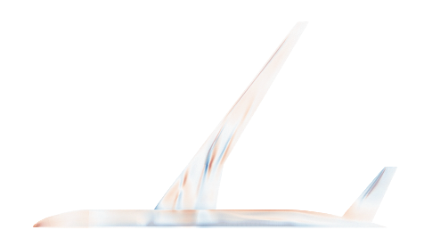 | __Sicheng He__, Rohit Kanchi.     __Matrix-Free Resolvent Analysis for Large-Scale Aerodynamic Systems__     _in preparation_.|
| 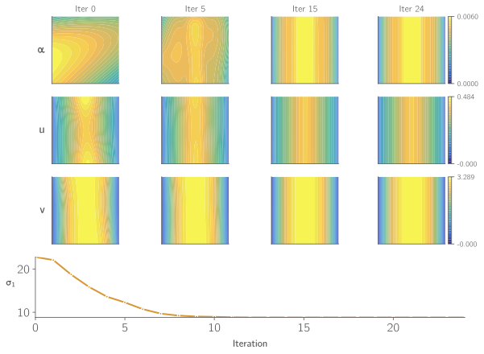 | __Sicheng He__, Shugo Kaneko, Max Howell, Daning Huang, Chi-An Yeh, Joaquim R. R. A. Martins.     __Large-Scale Flow Control Performance Optimization via Differentiable Resolvent Analysis__     _in preparation_.|
| 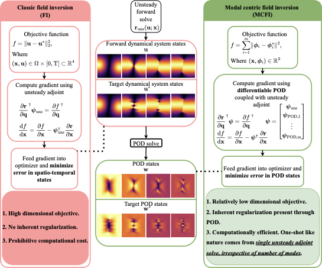 | Rohit Sunil Kanchi, __Sicheng He__.     [__Modal-Centric Field Inversion via Differentiable Proper Orthogonal Decomposition__](https://arxiv.org/abs/2601.14858)     _arXiv preprint_ (2026).|

## 3. Optimization, control, and learning of dynamical systems

**How do we control, optimize, and learn within structured dynamical representations?**

Once dynamics are represented and interpreted, we ask: how do we modify them—suppress instability, improve performance, learn closures, and design systems with dynamics as first-class constraints?
We combine adjoint methods, multidisciplinary optimization, and scientific machine learning to design, stabilize, and infer complex engineering systems governed by multiscale dynamics.

Key contributions include adjoint-based **stability-constrained design optimization**, **Hopf-bifurcation instability suppression** via the first Lyapunov coefficient, adjoint-based **control co-design**, a **fundamental** reverse algorithmic differentiation method for complex analytic functions yielding the **first succinct eigenvalue derivative formula for general complex matrices**, gradient-enhanced **neural network surrogates** for real-time aerodynamic analysis ([Webfoil](http://webfoil.engin.umich.edu/)), and the **differentiable Kalman filter** for physics-informed state estimation with **90% error reduction**.

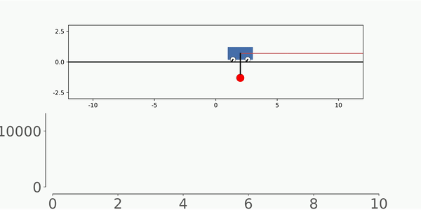
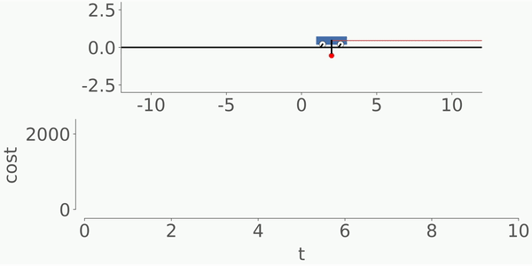

__Publication:__

|        |  |
|   :-:    | -       |
| 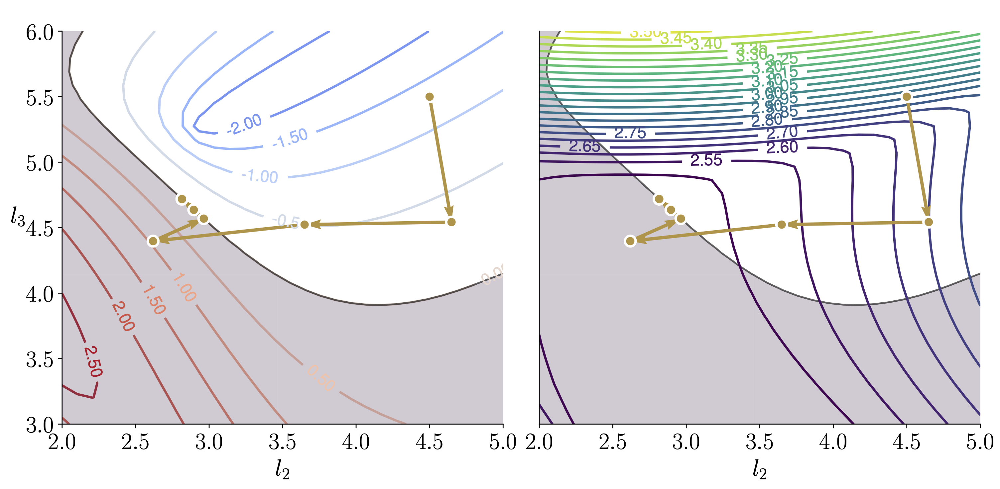 | __Sicheng He__, Eirikur Jonsson, Jichao Li, Joaquim R. R. A. Martins.     [__Adjoint-Based Design Optimization of Stability Constrained Systems__](https://arc.aiaa.org/doi/10.2514/1.J064273)     _AIAA Journal_ (2024).|
| 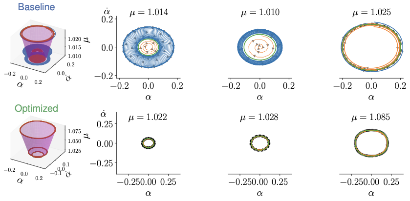 | __Sicheng He__, Max Howell, Daning Huang, Eirikur Jonsson, Galen W. Ng, Joaquim R. R. A. Martins.     [__Adjoint-based Hopf-bifurcation Instability Suppression via First Lyapunov Coefficient__](https://arxiv.org/abs/2511.03840)     _arXiv preprint_ (2025).|
| 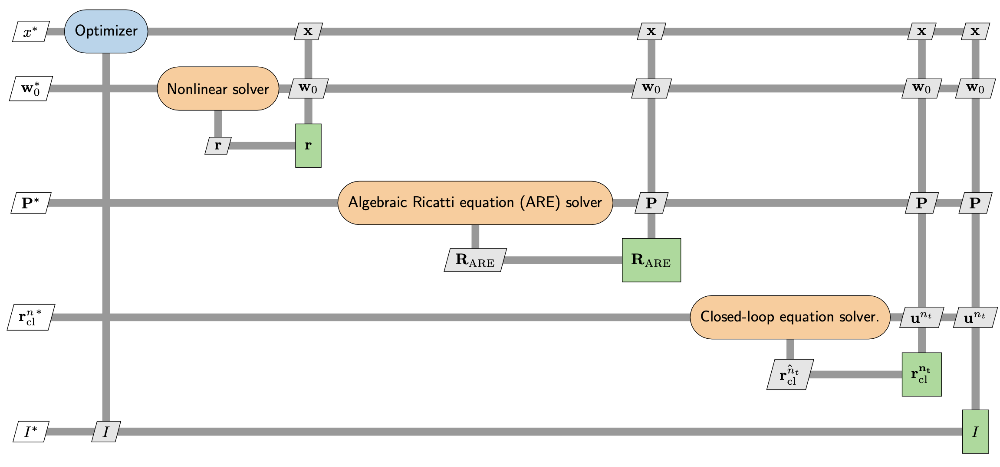 | __Sicheng He__, Shugo Kaneko, Eirikur Jonsson, Marco Mangano, Joaquim R. R. A. Martins.     [__Control co-design sensitivity computation using the adjoint method__](https://www.researchgate.net/publication/362931690_Eigenvalue_problem_derivatives_computation_for_a_complex_matrix_using_the_adjoint_method)     _submitted to SIAM applied dynamics (SIADS)_ (2022).|
| 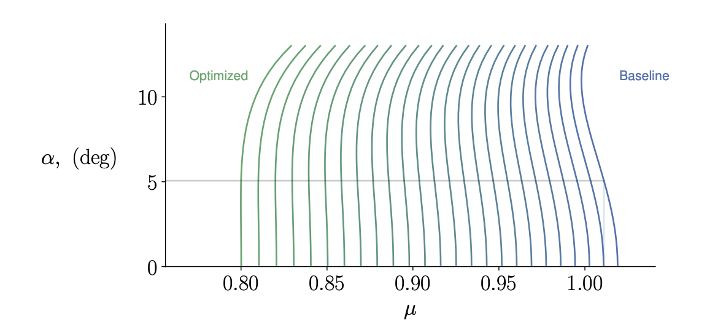 | __Sicheng He__, Eirikur Jonsson, Joaquim R. R. A. Martins.     [__Adjoint-based Limit Cycle Oscillation Instability Sensitivity and Suppression__](https://www.researchgate.net/publication/363581644_Adjoint-based_Limit_Cycle_Oscillation_Instability_Sensitivity_and_Suppression)     _Nonlinear dynamics_ (2022).|
| 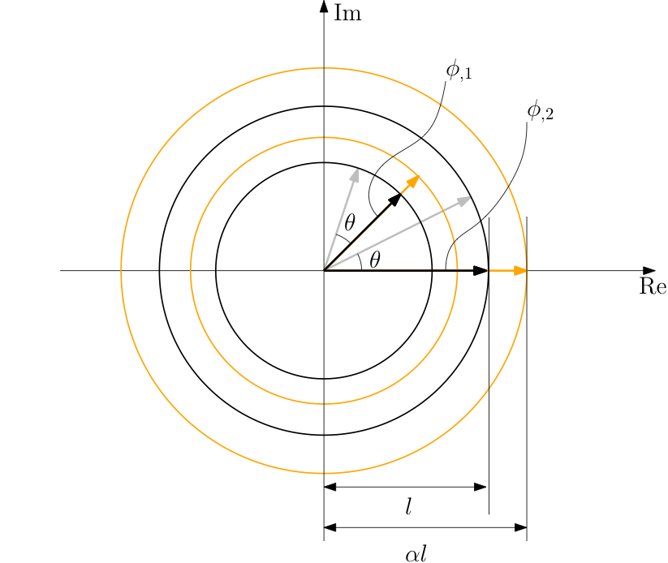 | __Sicheng He__, Yayun Shi, Eirikur Jonsson, Joaquim R. R. A. Martins.     [__Eigenvalue problem derivatives computation for a complex matrix using the adjoint method__](https://www.researchgate.net/publication/362931690_Eigenvalue_problem_derivatives_computation_for_a_complex_matrix_using_the_adjoint_method)     _MSSP (accepted)_ (2023).|
| 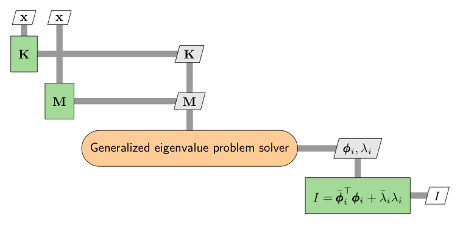 | __Sicheng He__, Eirikur Jonsson, and joaquim R. R. A. Martins.     [__Derivatives for Eigenvalues and Eigenvectors via Analytic Reverse Algorithmic Differentiation__](https://arc.aiaa.org/doi/abs/10.2514/1.J060726?journalCode=aiaaj)     _AIAA Journal_ (2022).|
| 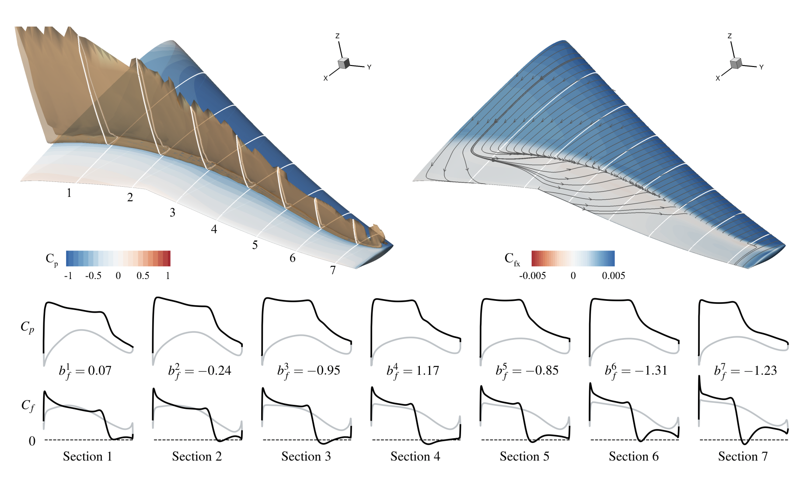 | Jichao Li, __Sicheng He__, Mengqi Zhang, Joaquim R. R. A. Martins, Boo Cheong Khoo.     [__Physics-Based Data-Driven Buffet-Onset Constraint for Aerodynamic Shape Optimization__](https://arc.aiaa.org/doi/10.2514/1.J061519)     _AIAA Journal_ (2022).|
| 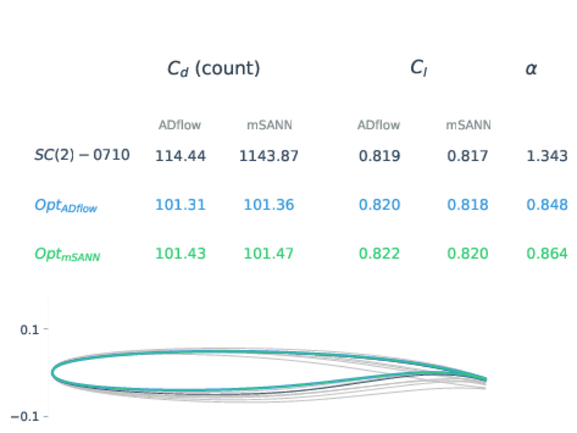 | Mohamed Amine Bouhlel, __Sicheng He__, and Joaquim R. R. A. Martins.    [__Scalable gradient-enhanced artificial neural networks for airfoil shape design in the subsonic and transonic regimes__](https://link.springer.com/article/10.1007/s00158-020-02488-5)     _Structural and Multidisciplinary Optimization_ (2020). (Webfoil)|
| 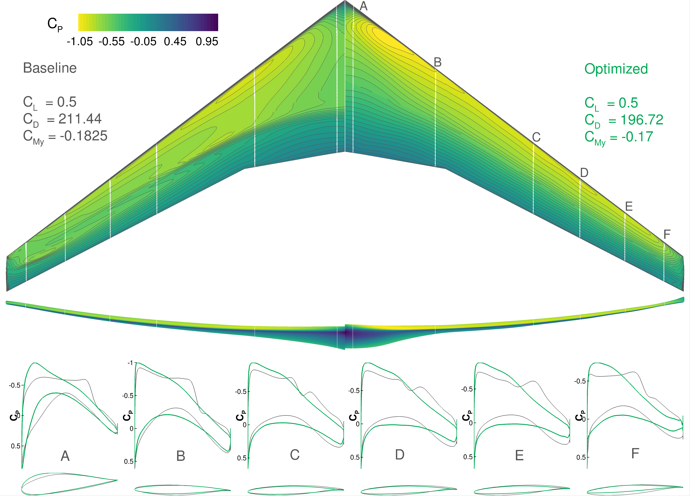 | Jichao Li, __Sicheng He__, and Joaquim R. R. A. Martins.    [__Data-driven constraint approach to ensure low-speed performance in transonic aerodynamic shape optimization__](https://www.sciencedirect.com/science/article/pii/S1270963819304912)     _Aerospace Science and Technology_ (2019).|
| 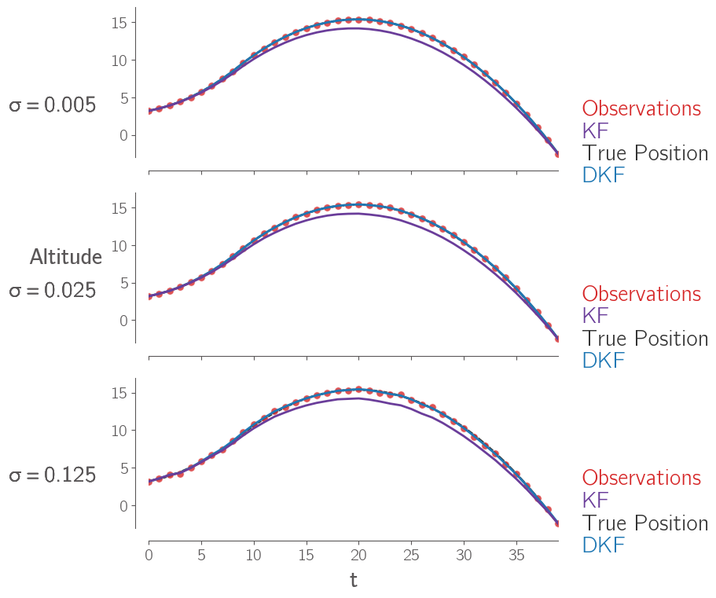 | Yuan Wu, __Sicheng He__.     [__DKFNet: Differentiable Kalman Filter for Field Inversion and Machine Learning__](https://arxiv.org/abs/2509.07474)     _arXiv preprint_ (2025).|

[Past research projects](/past-research/) — aeroelastic optimization, wind turbine MDO, laminar-turbulent transition, structural global optimization.